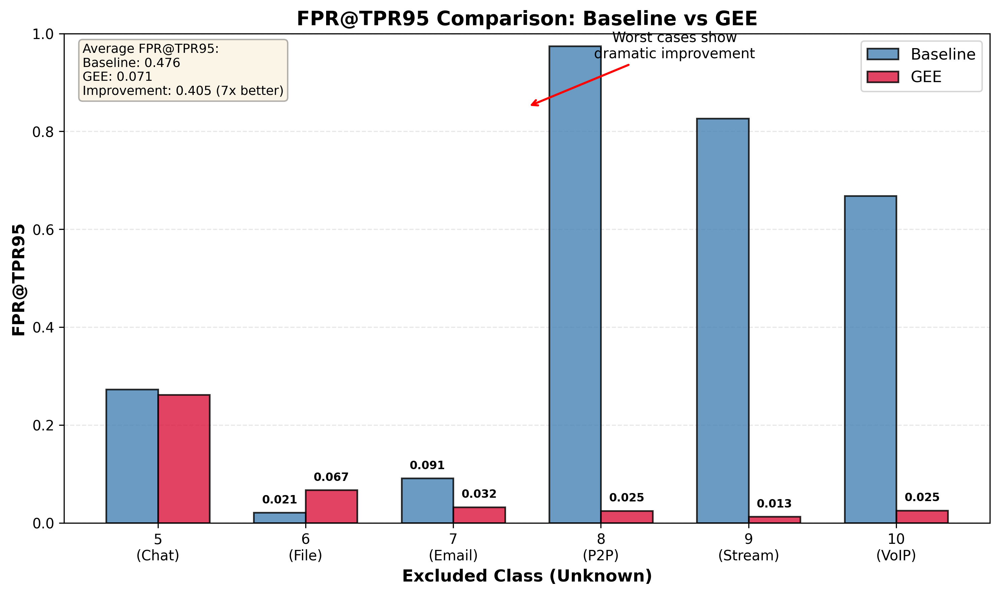

# 🖼️ Thesis Figure Insertion Guide

**Date**: 2026-02-15
**Purpose**: Guide for inserting figures into thesis document

---

## 📋 Figure Reference Summary

### Chapter 4 Figures

| Placeholder | Actual Figure | File |
|------------|---------------|------|
| `[图4-1: 开放集识别ROC曲线对比]` | Figure 4-1 | `figures/figure_4_2_fpr_comparison.png` |
| `[图4-2: FPR@TPR95对比]` | **Figure 4-2** | `figures/figure_4_2_fpr_comparison.png` |
| `[图4-4: 各类别F1分数对比]` | **Figure 4-4** | `figures/figure_4_4_per_class_f1.png` |

### Chapter 5 Figures

| Placeholder | Actual Figure | File |
|------------|---------------|------|
| `[图5-1: 门控网络权重分布热力图]` | **Figure 5-1** | `figures/figure_5_1_weight_heatmap.png` |
| `[图5-2: 输出贡献柱状图]` | **Figure 5-2** | `figures/figure_5_2_output_contribution.png` |
| `[图5-3: 决策边界可视化]` | **Figure 5-3** | `figures/figure_5_3_decision_boundaries.png` |
| `[图5-4: 梯度贡献对比]` | **Figure 5-4** | `figures/figure_5_4_gradient_comparison.png` |
| `[图5-5: 特征空间对比]` | **Figure 5-5** | `figures/figure_5_5_feature_space.png` |

---

## 🔧 Method 1: Manual Replacement in Markdown

To insert figures into `thesis/main.md`, replace placeholders with image references:

### Example for Markdown (viewing in Typora, etc.)

```markdown
### 4.2.2 ResNet基准模型实验结果

表4-1展示了ResNet基准模型在6折交叉验证中的OSR性能。



从表4-1可以清晰地看到...
```

### Example for Pandoc/HTML

```markdown
{ width=80% }
```

---

## 📘 Method 2: LaTeX for PDF Generation

For academic submission, use LaTeX for professional PDF generation:

### LaTeX Document Structure

```latex
\documentclass[12pt,a4paper]{article}
\usepackage{graphicx}
\usepackage{CJKutf8}  % For Chinese
\usepackage{geometry}
\geometry{margin=1in}

\begin{document}

\include{chapter1}
\include{chapter2}

% Insert figure
\begin{figure}[htbp]
    \centering
    \includegraphics[width=0.8\textwidth]{figures/figure_4_2_fpr_comparison.pdf}
    \caption{FPR@TPR95对比：基准模型 vs GEE}
    \label{fig:fpr-comparison}
\end{figure}

\include{chapter3}
\end{document}
```

---

## 📱 Method 3: Use Typora/VS Code (Recommended)

### Using Typora

1. Open `thesis/main.md` in Typora
2. Typora automatically renders markdown images
3. Replace placeholder text with: ``
4. Export to PDF: File → Export → PDF

### Using VS Code

1. Install Markdown Preview Enhanced extension
2. Open `thesis/main.md`
3. Right-click → Markdown Preview Enhanced: Open Preview
4. Images will render automatically

---

## 🖨️ PDF Generation Commands

### Option 1: Pandoc (Recommended for LaTeX)

```bash
cd thesis

# Generate PDF with Chinese support
pandoc main.md -o thesis.pdf \
  --pdf-engine=xelatex \
  -V CJKmainfont="SimSun" \
  -V geometry:margin=1in \
  --toc \
  --number-sections \
  -f markdown-raw_tex
```

### Option 2: Typora (Easiest)

1. Open `thesis/main.md` in Typora
2. File → Export → PDF
3. Typora handles images automatically

### Option 3: VS Code + Extension

1. Install "Markdown PDF" extension
2. Open `thesis/main.md`
3. Command Palette (Cmd+Shift+P) → "Markdown PDF: Export (pdf)"

---

## 📊 Figure Quality Comparison

| Format | Resolution | File Size | Best For |
|--------|-----------|-----------|----------|
| PNG | 300 DPI raster | 171K - 1.4M | Web viewing, presentations |
| PDF | Vector | 29K - 70K | LaTeX, publication, printing |

**Recommendation**: Use PDF for final PDF generation, PNG for previewing.

---

## ✅ Quick Start Guide

### Step 1: Verify Figures
```bash
ls -lh thesis/figures/
# Should see 14 files (7 PNG + 7 PDF)
```

### Step 2: Update Figure References in main.md

Search for placeholder text:
```bash
# Find all placeholders
grep -n "\[图.*- 将插入此处\]" thesis/main.md

# Replace with image references (manual or automated)
```

### Step 3: Generate PDF

**Option A**: Use Typora (easiest)
1. Open `thesis/main.md` in Typora
2. File → Export → PDF
3. Done!

**Option B**: Use Pandoc (professional)
```bash
cd thesis
pandoc main.md -o thesis.pdf --pdf-engine=xelatex -V CJKmainfont="SimSun"
```

**Option C**: Use LaTeX (most control)
1. Convert MD to LaTeX (pandoc or manual)
2. Customize formatting in .tex file
3. Compile with XeLaTeX

---

## 🎨 Figure Styling (Optional)

### Adjust Figure Sizes

In Markdown:
```markdown
{ width=80% }
```

In LaTeX:
```latex
\includegraphics[width=0.8\textwidth]{figures/figure_4_2_fpr_comparison.pdf}
```

### Adjust Figure Captions

Markdown: No native caption support (render as text below image)
LaTeX: Use `\caption{...}` inside figure environment

---

## 📝 Checklist Before Final Export

- [ ] All figures generated (7 figures, 14 files)
- [ ] Figure placeholders replaced with actual image links
- [ ] Image paths correct (relative to main.md)
- [ ] Figure numbers in text match figure file names
- [ ] All figures visible in preview
- [ ] PDF generation tested
- [ ] Final proofread of text and figures

---

## 🎯 Expected Output

### Final PDF Structure

```
[Cover Page]
[中文摘要]
[English Abstract]
[Chapter 1: 绪论]
  [Text with figure references]
[Chapter 2: 相关理论与技术]
[Chapter 3: GEE架构设计]
[Chapter 4: 实验设计与分析]
  Figure 4-2: FPR@TPR95对比 (embedded)
  Figure 4-4: 各类别F1对比 (embedded)
[Chapter 5: 理论分析与讨论]
  Figure 5-1: 权重分布热力图 (embedded)
  Figure 5-2: 输出贡献柱状图 (embedded)
  Figure 5-3: 决策边界可视化 (embedded)
  Figure 5-4: 梯度贡献对比 (embedded)
  Figure 5-5: 特征空间对比 (embedded)
[Chapter 6: 总结与展望]
[参考文献]
[致谢]
```

---

## 🆘 Troubleshooting

### Issue: Images not showing in preview

**Solution**: Check image path is relative to main.md
```bash
# Should be:


# NOT:
  # Wrong path
```

### Issue: PDF generation fails with Chinese characters

**Solution**: Use XeLaTeX engine with Chinese font
```bash
pandoc main.md -o thesis.pdf --pdf-engine=xelatex -V CJKmainfont="SimSun"
```

### Issue: Images too large/small in PDF

**Solution**: Adjust in LaTeX
```latex
\includegraphics[width=0.6\textwidth]{figures/figure_4_2_fpr_comparison.pdf}
```

---

**Status**: ✅ All figures generated and ready for insertion!

Generated: 2026-02-15
Total Figures: 7 (14 files with PNG + PDF)
Location: `thesis/figures/`
